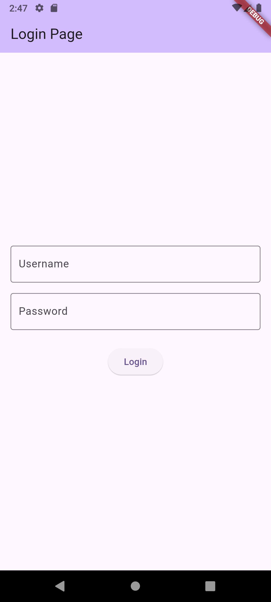

# Simple Login UI

A simple and clean login screen UI built with Flutter. This project serves as a basic example of handling user input and triggering actions in a Flutter application.

## Features

-   User-friendly interface with fields for username and password.
-   Secure password entry with obscured text.
-   A "Login" button that prints the credentials to the debug console.
-   Built with Material 3 design principles.

## Screenshot

Here's what the app looks.

| Login Page |
| :---: | :---: |
|  |

!Simple Login UI Screenshot

## Getting Started

To get a local copy up and running, follow these simple steps.

### Prerequisites

You need to have Flutter installed on your machine. For instructions, see the official Flutter documentation.

### Installation

1.  Clone the repo (you'll need to update the URL to your repository's URL if you host it on GitHub/GitLab etc.)
    ```sh
    git clone https://github.com/your_username/simple_login_ui.git
    ```
2.  Navigate to the project directory
    ```sh
    cd simple_login_ui
    ```
3.  Install dependencies
    ```sh
    flutter pub get
    ```
4.  Run the app
    ```sh
    flutter run
    ```

